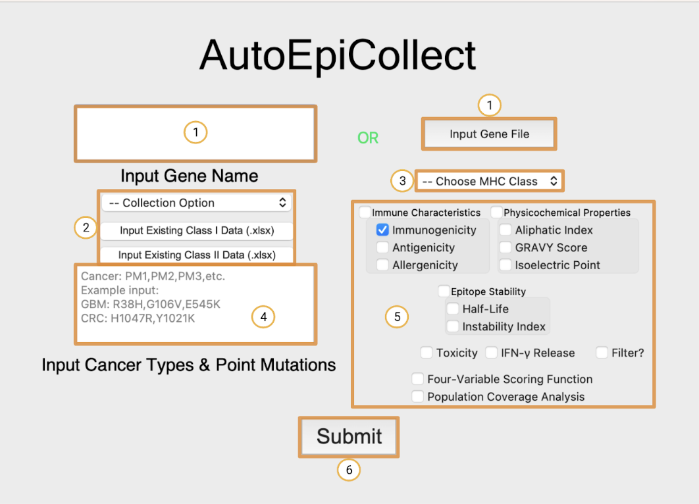
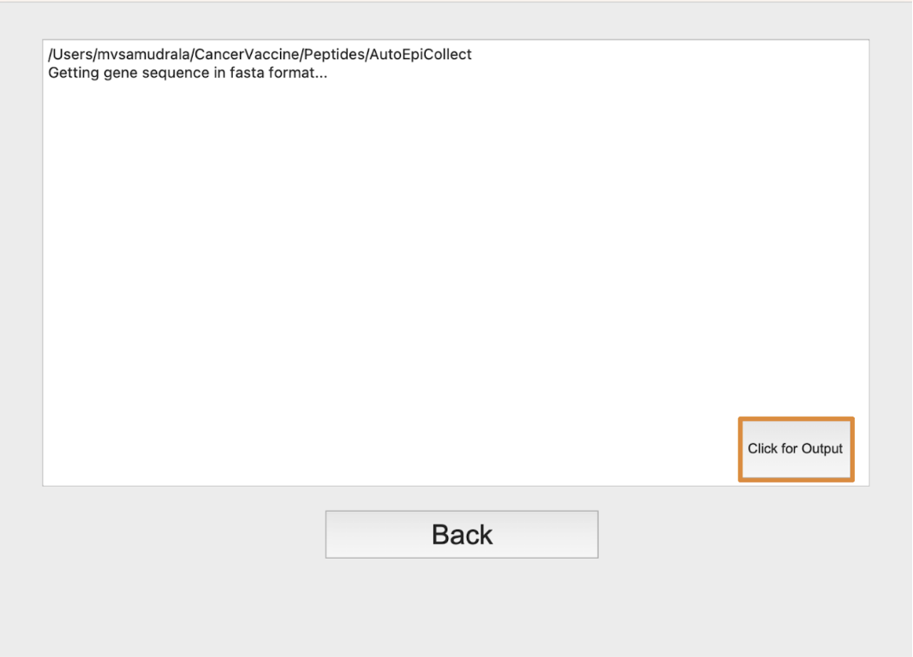

# User Guide
In this section, you will learn how to operate AutoEpiCollect and access the outputted files to view your final 
epitope results.
## Opening AutoEpiCollectGUI
First, navigate to the AutoEpiCollect directory using these command::

Windows:
```cmd
cd %HOMEPATH%
cd AutoEpiCollect
```
Mac and Linux:
```bash
cd ~
cd AutoEpiCollect
```
To open the GUI program, enter the following commands into your Terminal or Anaconda Prompt::
```bash
conda activate aec_venv
python AutoEpiCollectGUI.py
```
Please be prepared to wait up to 2 minutes for the GUI to open on its first run. You should see a screen 
similar to this one pop up.

## Inputting Required Data and Configuring Run Settings
The numbered boxes in the home screen above show the order of inputs:

1. These two fields are for specifying the gene target. The white box on the left is where you can type in the 
   name of your gene target. AutoEpiCollect will retrieve a FASTA-formatted file of this gene's peptide sequence 
   from UniProt. The button on the right is if you want to input your own FASTA-formatted gene sequence. Simply 
   click this button and choose your desired FASTA-formatted file. 
2. This field specifies how you want your epitope data to be collected. There are two options from the drop-down 
   menu, "Collect New Data" and "Update Existing Data". Choose the "Collect New Data" option if you want to start 
   the epitope selection process from scratch. Choose the "Update Existing Data" option if you have collected some 
   epitope data, but want to add to this data with available epitope characteristics not chosen in the past. If you 
   have selected the "Update Existing Data" option, please click the "Input Existing Class I (or Class II) Data" 
   button and choose your incomplete data file. Remember that this file must be the **unranked and unfiltered 
   epitope Excel file** for this option to work. A summary of all the initial and final filenames will be discussed 
   down below.
3. The third field is a drop-down menu asking which MHC Class you would like to collect epitope data from. You can 
   choose to collect Class I, Class II, or Class I and II data.
4. Field four is for inputting cancer types and point mutations of interest. Input a name or abbreviation of 
   each cancer type you are studying, as well as the relevant missense mutations associated with each cancer. Please 
   format the cancers and mutations exactly how you see in the example, with a new line separating each cancer.
5. Field five is where you specify the run configurations for the epitope selection process. Each epitope 
   characteristic is grouped into categories based on its properties. Binding affinity is obtained by default and 
   cannot be switched off. Click on the epitope characteristics that you want AutoEpiCollect to obtain when 
   selecting the top epitopes. The four-variable scoring function requires the immune characteristics in order to 
   work. Because of this, checking the four-variable scoring function box will automatically select the immune 
   characteristics. Filtering is based off of the epitope stability characteristics, toxicity, and IFN-gamma release.
   If filtering is checked, AutoEpiCollect will filter epitope data according to the filtering characteristics that 
   are checked. For example, if you want to filter epitope data and only toxicity and half-life are checked, then 
   filtering will take place based on these two characteristics. If instability is checked as well, then filtering 
   would be based off of all three characteristics. The last checkbox is for population coverage analysis. This setting 
   allows AutoEpiCollect to calculate the coverage of a vaccine composed of the top epitopes predicted by 
   AutoEpiCollect. This setting is optional, but is important when determining the utility of your finalized vaccine. 
6. The final button on the home screen labeled six is the submit button. Pressing this button will take you to the 
   output window shown below where you can view the progress of AutoEpiCollect's epitope selection method with live updates.

## Output Window and Viewing Final Epitope Results

After pressing the submit button, you will be taken to this output window which shows live updates of 
AutoEpiCollect's progress. During this time, you will be allowed to hit the back button and view what options you 
have selected, but you cannot restart the epitope selection process until the program is complete or until you close 
out the program while it is running. Clicking on the "Click for Output" button when the program is completed will 
open an Excel file ("all_variables_{mhci or mhcii}.xlsx") of all the pre-ranked and pre-filtered epitope data collected, 
organized by 
point 
mutation. View 
the table below to learn about what possible output files are made during AutoEpiCollect's epitope selection process.
You can find all the files if you navigate to the created AutoEpiCollect directory.

| File*                                           | Description                                                                                                                                                                                                                      |
|-------------------------------------------------|----------------------------------------------------------------------------------------------------------------------------------------------------------------------------------------------------------------------------------|
| {gene_target}.fasta                             | The protein sequence of your gene target.                                                                                                                                                                                        |
| mutant_gene_fastas                              | Mutated sequences of your gene target based on all the point mutations inputted.                                                                                                                                                 |
| Sequences                                       | A folder containing .txt and .fasta files of mutated 9-10mer (MHC I) and mutated 15mer (MHC II) epitopes used as input for in-silico tools. These tools were used to collect selected epitopes characteristics.                  |
| all_variables_{mhci or mhcii}.xlsx*               | All possible mutated epitopes and selected characteristics to be included in the data collection process. **This file must be used as the starting file when updating existing data**. This file is organized by point mutation. |
| all_epitopes_by_cancer_{mhci or mhcii}.xlsx*      | All possible mutated epitopes and selected characteristics to be included in the data collection process. This file is organized by cancer type.                                                                                 |
| all_variables_ranked_{mhci or mhcii}.xlsx*        | All possible mutated epitopes ranked by AutoEpiCollect's scoring function. This file is organized by point mutation.                                                                                                             |
| ranked_epitopes_by_cancer_{mhci or mhcii}.xlsx*   | All possible mutated epitopes ranked by AutoEpiCollect's scoring function. This file is organized by cancer type.                                                                                                                |
| top_epitopes_{mhci or mhcii}.xlsx*                | Filtered epitopes meeting the exclusion criteria. These epitopes may or may not be ranked based on the desired settings. This file is organized by point mutation.                                                               |
| top_epitopes_by_cancer_{mhci or mhcii}.xlsx*      | Filtered epitopes meeting the exclusion criteria. These epitopes may or may not be ranked based on the desired settings. This file is organized by cancer type.                                                                  |
| filtered_epitopes_{cancer}_{mhci or mhcii}.txt  | A list of all epitope/HLA pairings in each cancer type inputted into PCOptim/PCOptim-CD. The corresponding cancer type will be shown inside the {cancer} brackets.                                                               |
| optimized_epitopes_{mhci or mhcii}.xlsx*          | Optimized epitopes chosen by PCOptim-PCOptim-CD to be inputted into the population coverage analysis tool. This file is organized by point mutation.                                                                             |
| optimized_epitopes_{cancer}_{mhci or mhcii}.txt | Optimized epitopes chosen by PCOptim-PCOptim-CD to be inputted into the population coverage analysis tool. This file is organized by cancer type.                                                                                |
| population_coverage_results_{mhci or mhcii}.xlsx*  | Population coverage results for both the regular (filtered) and optimized list of epitope/HLA pairs. The coverages are calculated for each major world region.                                                                   |
| Population_Coverage_Plots                       | A folder containing population coverage graphs for both the regular (filtered) and optimized list of epitope/HLA pairs. There are graphs for each major world region.                                                            |

*If the "Update Existing Data" option is selected, these files will show as "{filename}_updated.xlsx" 

## Pre-Installed Files with AutoEpiCollect
This next table below details the files that come with AutoEpiCollect's installation process. Users should not 
delete or tamper with any of these files as they are needed for AutoEpiCollect to run smoothly.

| File                            | Description                                                                                                                                               |
|---------------------------------|-----------------------------------------------------------------------------------------------------------------------------------------------------------|
| docs                            | A folder with the documentation you are reading right now.                                                                                                |
| immunogenicity                  | A folder with IEDB's MHC Class I immunogenicity tool.                                                                                                     |
| .readthedocs.yaml               | A file specifying the build for the documentation page using readthedocs.                                                                                 |
| AutoEpiCollectGUI.py            | The main GUI program used for AutoEpiCollect's epitope selection method. This should be the only pre-installed file that you will open and interact with. |
| PopCoverageOptimization.java    | This is PCOptim, the program used for optimizing MHC Class I epitope/HLA pairs before population coverage analysis.                                       |
| CD4PopCoverageOptimization.java | This is PCOptim-CD, the program used for optimizing MHC Class II epitope/HLA pairs before population coverage analysis.                                   |
| MHCI_HLA_input.txt              | The 27-allele HLA Class I reference set.                                                                                                                  |
| MHCII_HLA_input.txt             | The 27-allele HLA Class II reference set.                                                                                                                 |
| environment.yml                 | The .yml file specifying the dependencies used to create the conda virtual environment for AutoEpiCollect.                                                |
| mkdocs.yml                      | Another file specifying the build for the documentation page.                                                                                             |
| refactored_trainingset_cd4.csv  | This is the training data used for the MHC Class II scoring function.                                                                                     |
| refactored_trainingset_cd8.csv  | This is the training data used for the MHC Class I scoring function.                                                                                      |

This is the end of the AutoEpiCollect documentation webpage and user guide. For further questions or persisting 
issues please contact mvsamudrala@gmail.com