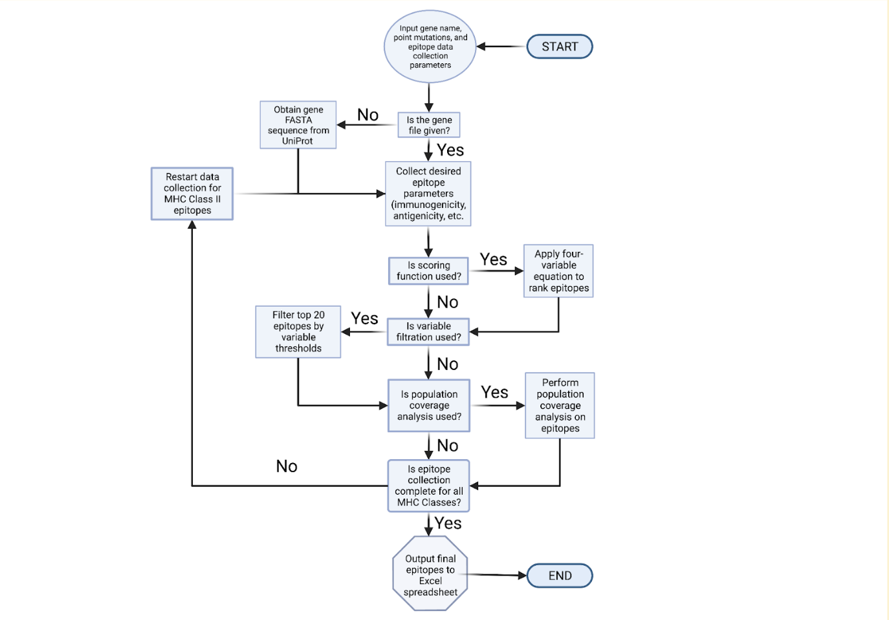
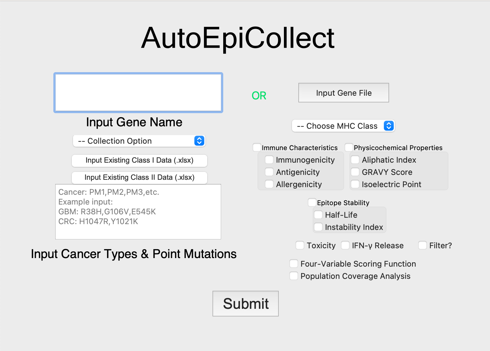

# Welcome to AutoEpiCollect!
This is the AutoEpiCollect documentation site. Here, you will learn how to download, install, and use both the 
console and GUI versions of AutoEpiCollect in order to collect immunogenic epitopes for a vaccine 
targeting any cancer(s) of your choice. 

AutoEpiCollect is a software that uses web-scraping, tools from the Immune Epitope Database and Analysis Resource 
(IEDB), and machine learning to predict potentially immunogenic neoantigens for any oncogene. 

AutoEpiCollect workflow chart:

AutoEpiCollect GUI homepage:

Please click the tabs above to go through the installation process and use documentation for AutoEpiCollect.
