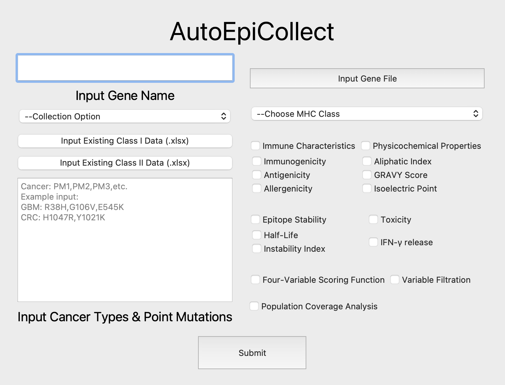
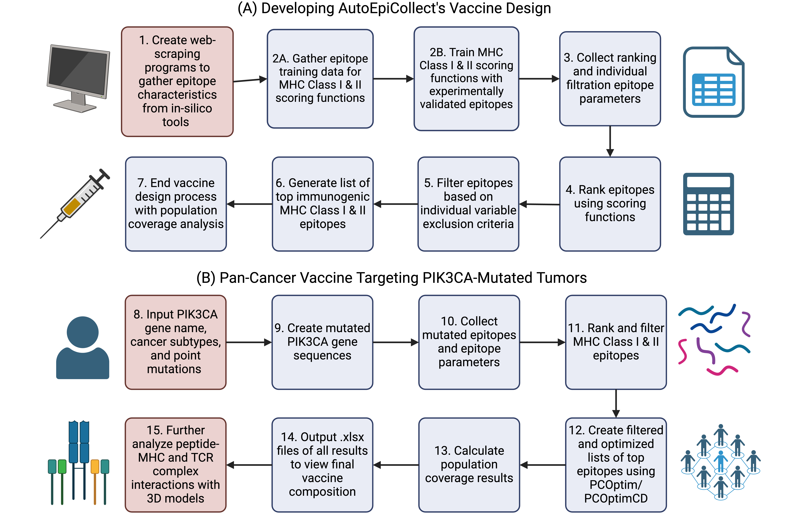

# Welcome to AutoEpiCollect!
This is the AutoEpiCollect documentation site. Here, you will learn how to download, install, and use the GUI 
version of AutoEpiCollect in order to collect immunogenic epitopes for a vaccine targeting any cancer(s) of your choice. 

AutoEpiCollect is a software that uses web-scraping, tools from the Immune Epitope Database and Analysis Resource 
(IEDB), and machine learning to predict potential T-cell eliciting epitopes targeting any gene of interest.

AutoEpiCollect GUI homepage:

AutoEpiCollect workflow chart:

Please click the tabs above to go through the installation process and use documentation for AutoEpiCollect.

